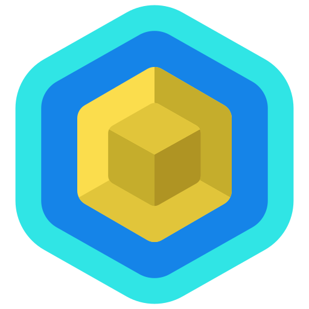

# NiftyNet - NFT Marketplace

NiftyNet is a digital marketplace for buying, selling, and discovering exclusive digital assets from top artists in the NFT world. The platform offers categories like Music, Photography, Art, and Gaming, featuring top creators and sellers.

## Features

- **Browse Collections**: Explore NFTs in categories like Music, Photography, and more.
- **Top Creators & Sellers**: View and connect with the most popular NFT creators and sellers.
- **User Interaction**: Discover, purchase, and sell digital assets.
- **Responsive Design**: Optimized for both desktop and mobile devices.

## Tech Stack

- **Frontend**: HTML, CSS, JavaScript
- **Icons**: Ionicons
- **Responsive Layout**: Flexbox, Grid
